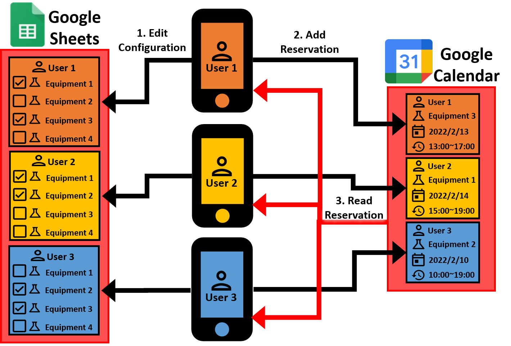

## What this App does

**1. Edit Configuration**   
Select equipments that you will be using in Google Sheets   

**2. Reserve Equipment**   
Create an reservation in Google Calendar   
The reservation will be automatically visible to other people

**3. Check Reservations**   
Check other peoples' reservations in Google Calendar   
You will only see reservations of the equipments you chose

**4. Record Experiment Conditions**   
Record experiment conditions in Google Sheets   
Save experiment conditions to the corresponding event in Google Calendar  

**5. Check Past Experiment Conditions**   
Check past experiment conditions in Google Sheets   

**6. Log all reservations**   
Daily log @4 AM   
Saves events from 2 days ago to Google Sheets   

**7. Log all events**   
Saves add/modify/delete event of reservations to Google Sheets   

## Requirements
1. Google Account for administrator and each users
2. Smartphones or computers to access the Google Calendar and Sheets service
3. No fees are required (at the time of writing: 2022/02/14)

## Capability
1. 18 users (can be increased to 36, 54,... by running scripts simultaneously)
2. 150 reservations total per day (for 18 users)

