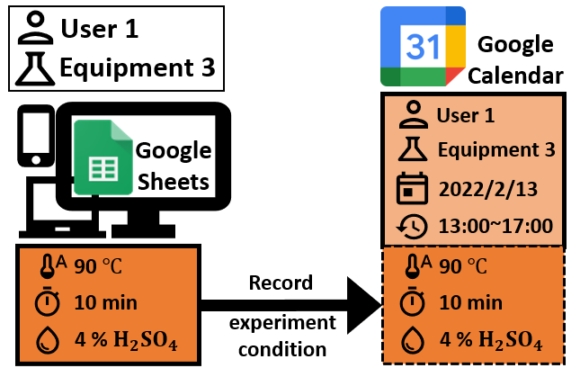

## このアプリでできること

**1. 設定の変更**   
Google Sheetsにおいて使用する装置を指定することができる  

**2. 装置の予約**   
Google Calendarにて装置の予約を行うことができる   
予約は自動的に他のユーザーから確認できる状態になる

**3. 他ユーザーの予約の確認**   
Google Calendarで他のユーザーの予約状況を確認することができる   
1で選んだ装置のみ表示するようになっている

**4. 実験に用いた工程(温度・加熱時間・濃度など)の保存**   
Google Sheetsにて実験の工程を記録することができる   
Google Calendarの対応する予約にコメントとして反映される  

**5. 過去の実験の工程の確認**   
Google Sheetsにて過去の実験の工程の確認を行うことができる   

**6. すべての予約をログとして保存**   
毎日、朝4時に2日前の予約をGoogle Sheetsにログとして保存することができる   

**7. すべての操作をログとして保存**   
予約の追加・変更・削除履歴をすべてGoogle Sheetsに保存することができる   

## 必要なもの
1. 管理者と各ユーザーがGoogleアカウントを作る必要がある
2. Google CalendarとGoogle Sheetsにアクセスするための端末（スマートフォン・パソコン等）
3. 現時点(2022/02/14)では無料で使用できる

## アプリの処理の最大量
1. 18ユーザー (スクリプトを同時に実行することで36ユーザー, 54ユーザー,...と増加させることができる)
2. 一日あたり合計150個の予約 (18ユーザーの場合)

