## Setting Up (administrator side)
### Create a Google account
### Create a Google Group
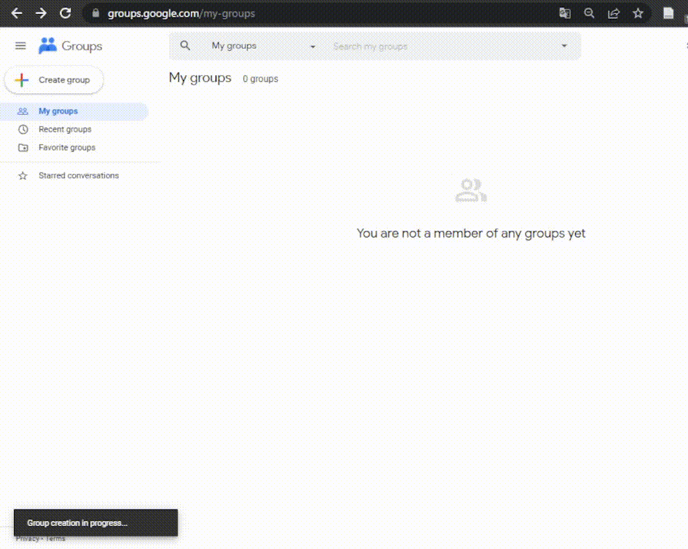

1. Access https://groups.google.com/my-groups
2. Create group as shown in the right
   

3. Change settings as shown in below pictures

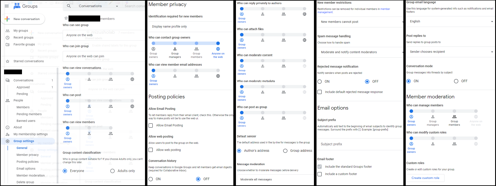

### Create a Spreadsheet
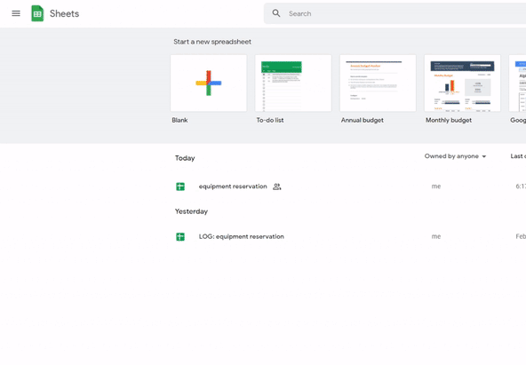

1. Open https://docs.google.com/spreadsheets/ and create a empty spreadsheet
2. import `equipmentSettings.xlsx` into spreadsheet

### Create Calendars
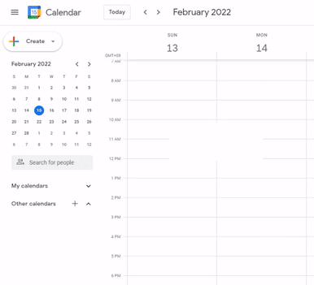

1. Create **36** calendars in Google Calendar with an arbitary name

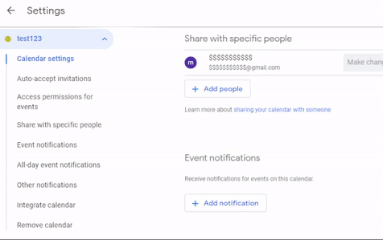

2. For every calendar, set modification priveledge to Google Group users

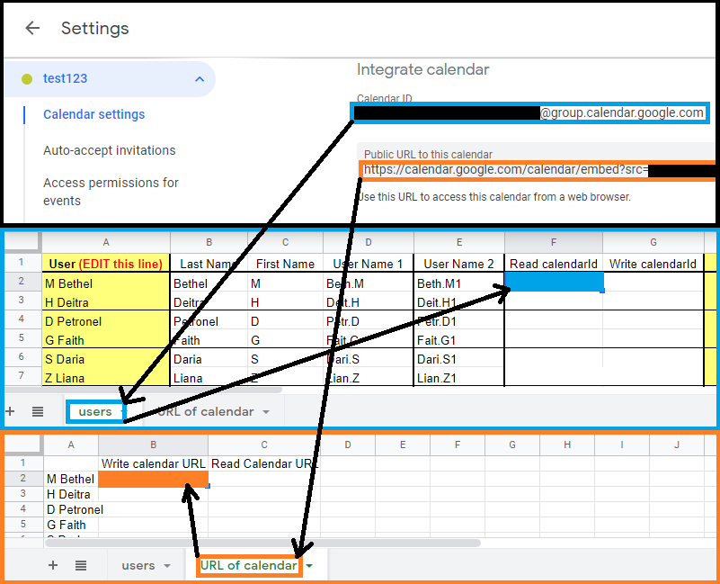   

3. write the calendar ids into `Write Calendar id` and `Read Calendar id` rows in sheets
4. write the calendar urls into sheet named `URL of Calendar`

### Create a GAS Project 
1. Go to https://script.google.com/home and click New project
2. Copy the contents of `equipmentReservation.js` to the new project's source code
3. In the script, change {spreadsheetId} to your spreadsheet id, and {logSpreadsheetId} to your log spreadsheet id
4. In the GAS project, run the function CreateTriggers()
5. Publish the project

<!-- USAGE EXAMPLES -->
## Setting Up (user side)
### Join Google groups

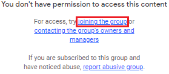   

1. Create a Google account
2. Access https://groups.google.com/forum/#!forum/{group_name}/join (ask the administrator for {group_name})
3. Select "join group"

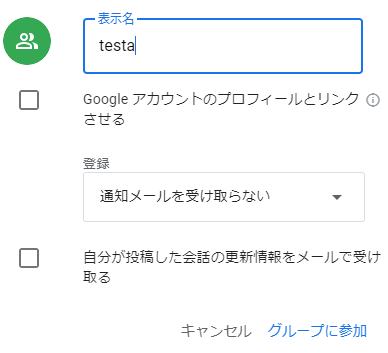   

4. Fill out the form like the following image. Use a display name that can be understood to the admin.
5. Subscription is complete. The security settings in the google groups is very strict, therefore you cannot see other members, and cannot post group emails.   

### Initial settings
1. Adding you as an user
   1. Enter your name. Refer to ① in the below picture.
   2. Link for sheets：https://docs.google.com/spreadsheets/d/{spreadsheet_id}/edit?usp=sharing
2. Select devices you will use
   1. Check the devices you would like to use. Refer to ③ in the below picture.   

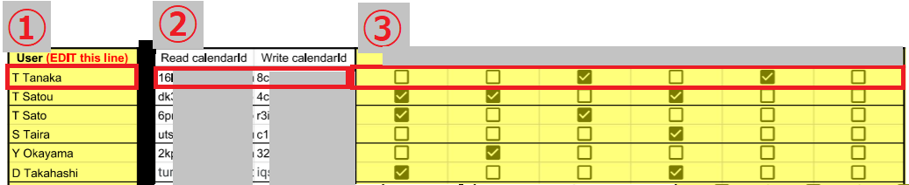   

### Add the user calendars to your calendar application (in your smartphone or on your PC)
1. Links for Read(read only) calendar and Write(write only) calendar are prepared. (Don't use the link in ➁)
2. Select the sheet named "URL of Calendar", and click the link like the figure below. Google calendar will open and you can add the calendar.   

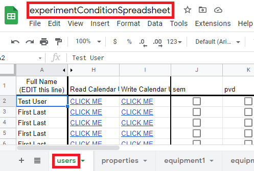   

### Adding a reservation (Write calendar)
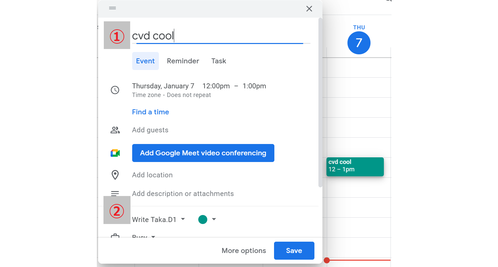   

1. Add an event on Google calendar
2. Title should be`[Device] [State]`. Refer to ① in the below picture. Refer to `naming conventions` for naming convention of Device and State.
3. Add the event to `Write [User Name]`. Refer to ① in the below picture.

### naming conventions
- Devices (__You can change the name of devices in Sheets__)
-  | Device | Description |
   | ---- | ---- |
   | cmp  | Chemical mechanical planarization |
   | rie  | Reactive ion etching |
   | cvd  | Chemical vapor deposition |
   | pvd  | Physical vapor deposition |
   | euv  | Extreme ultraviolet lithography |
   | diff | Diffusion |
   | cleg | Cleaning |
   | dicg | Dicing |
   | pack | Packaging |
- States of equiment
-  | State | 説明 |
   | ---- | ---- |
   | evac | evacuation |
   | use/[NO ENTRY] | Main operation |
   | cool | cooling |
- Users (__You can add users in Sheets__)
-  | User Name | 名前 |
   | ---- | ---- |
   | Tana.Y1 | Tanaka Yuusuke |
   | Tana.Y2 | Tanabe Yuta |
   | Tana.S1 | Tanahashi Shion |
   | Chen.F1 | Chen Fan |
   | Zhu.Y1  | Zhu Yu |

### Observing reservations (Write calendar)
1. Observe events on Google Calendar
2. Event title is `[Name] [Device] [State]`.
3. If there are too many reservations and it is overwhelming, you can hide the Read calendar in your calendar app and view it only when you need to.

### Writing experiment conditions (Experiment Sheets)
1. Open Experiment Sheets
2. Find the current event that you created in Google Calendar
3. Write experiment conditions in Sheets
4. The conditions will automatically get updated to the event in Google \Calendar.

>The implementations details are in [details (Japanese)](https://github.com/rayanti/equipment-reservation/blob/master/details.md).

## Usage
- The equiment reservation infos are shown (as events) in Google Calendar. Clients will check the reservations on their PCs or phones, and make a reservation at an avaliable time (by creating events).
- Settings like display name, what equipments to show in Google Calendar are saved in a Google Sheet.
## About The Project
- This project uses a service called [Google Apps Script(GAS)](https://script.google.com/home/start). GAS enables Google services to be connected by scripts. We will use Google Sheets and Google Calendar in this project.
- The language used in GAS is JavaScript with V8 syntax (V8 is a runtime which is used in Chrome and Node.js).
- Sheets acts as a database for user information, preferences and logging. Calendar acts as an UI and is used for adding, modifying, reviewing event.
- There are two types of calendars we will use. The write calendar will be modified by the clients. The read calendar will be modified by the GAS service. When an event is modified on a write calendar, GAS applies the modification on the read calendar.

<!-- ROADMAP -->
## Roadmap
See the [open issues](https://github.com/rayanti/equipment-reservation/issues) for a list of proposed features (and known issues).

<!-- CONTRIBUTING -->
## Contributing
Contributions are what make the open source community such an amazing place to be learn, inspire, and create. Any contributions you make are **greatly appreciated**.
1. Fork the Project
2. Create your Feature Branch (`git checkout -b feature/AmazingFeature`)
3. Commit your Changes (`git commit -m 'Add some AmazingFeature'`)
4. Push to the Branch (`git push origin feature/AmazingFeature`)
5. Open a Pull Request

<!-- LICENSE -->
## License
Distributed under the MIT License. See `LICENSE` for more information.

<!-- ACKNOWLEDGEMENTS -->
## Acknowledgements
* [Best-README-Template](https://github.com/othneildrew/Best-README-Template)
